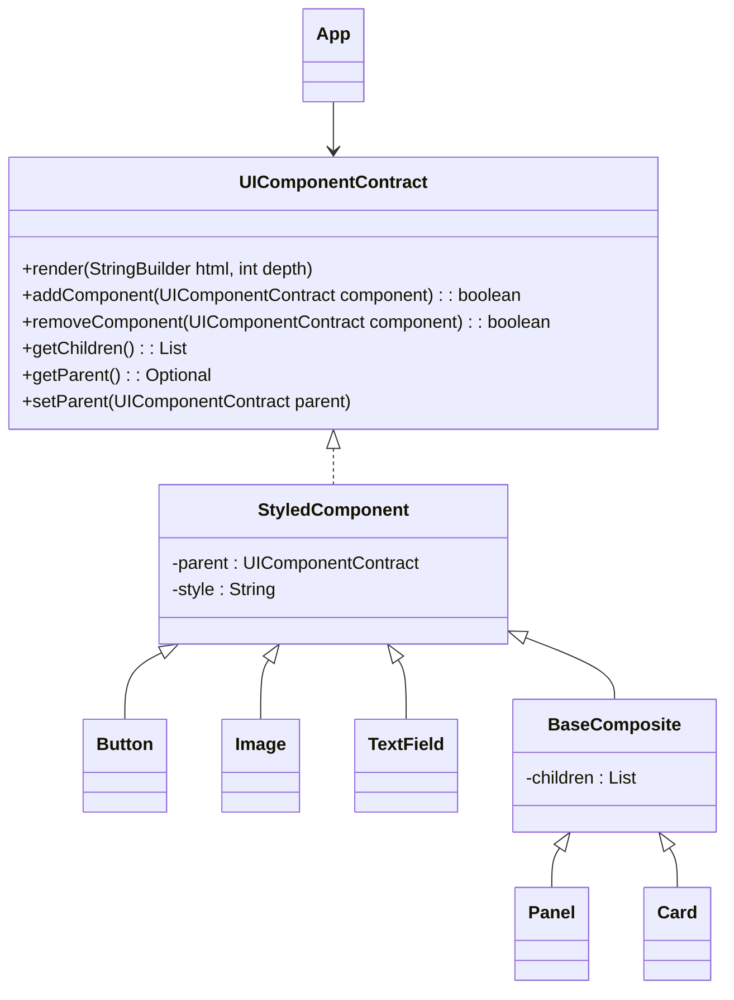
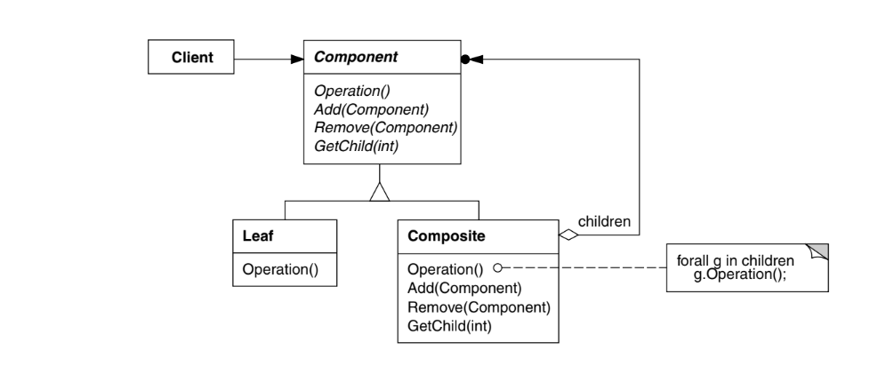

# Composite

## Intenção
Permite compor objetos em estruturas de árvore para representar hierarquias parte-todo, tratando objetos individuais (**folhas**) e composições (**nós**) de maneira uniforme. Com o padrão Composite, o cliente pode **interagir com todos os componentes por meio de uma interface comum**, sem se preocupar se está lidando com um objeto simples ou com uma composição de objetos.

### Também conhecido como
- **Parte Todo**
- **Composição Recursiva**
---
## Motivação
Em aplicações gráficas ou sistemas de interfaces, como editores de desenhos ou construtores de páginas web, os usuários frequentemente combinam elementos simples (botões, imagens, campos de texto) para formar estruturas mais complexas (painéis, cartões, formulários).

**Código representando o app sem uso do Composite**
@import "src/app/AppWithoutComposite.java"

Uma implementação sem o Composite exige que o cliente trate separadamente objetos simples e agrupados, aumentando a complexidade e o acoplamento do código.

Ao utilizar o Composite, podemos encapsular tanto elementos individuais quanto composições dentro de uma única interface, simplificando o gerenciamento e a renderização hierárquica dos componentes da interface.

`💡 Ao tratar componentes individuais e composições de forma uniforme, o código cliente se torna mais simples e flexível, facilitando a manutenção e a expansão do sistema.`

---

## Aplicabilidade

Use o padrão Composite quando:

- Você precisa representar hierarquias parte-todo, onde objetos simples podem ser agrupados em composições.
- É desejável que os clientes tratem objetos individuais e composições de maneira uniforme.
- O sistema precisa ser escalável e permitir a adição de novos tipos de componentes sem alterar a lógica do cliente.
----

## Exemplo Aplicado

--- 
## Estrutura GOF

### Participantes

#### Component (UIComponentContract)
- Declara a interface para os componentes de UI, definindo operações como `render()`, `addComponent()`, `removeComponent()`, entre outras.
#### Leaf (Button, Image, TextField)
- Representam os elementos individuais da interface que não possuem filhos.
- Implementam a operação de renderização para gerar HTML de forma autônoma.
#### Composite (Panel, Card)
- Armazenam e gerenciam outros componentes, podendo conter tanto elementos Leaf quanto outros Composites.
- Implementam a renderização delegando a chamada de render para seus componentes filhos, permitindo a composição recursiva.
#### Client (App)
- Constrói a hierarquia de componentes, combinando elementos simples e composições para formar a interface final.
- Responsável por gerar o HTML completo a partir da árvore de componentes.

### Colaborações
- **Cliente e Component**: O cliente (classe App) interage exclusivamente com a interface `UIComponentContract`, adicionando e removendo componentes sem precisar distinguir entre folhas e compostos.
- **Composite e Component**: Os componentes compostos (Panel, Card) armazenam outros componentes e delegam as chamadas de renderização aos seus filhos, formando uma estrutura em árvore.
- **Leaf e Composite**: Componentes simples (Leaf) implementam operações específicas de renderização, enquanto os compostos agrupam e organizam esses elementos de forma hierárquica.

### Consequências

#### Benefícios
1. **Uniformidade no Tratamento**: Clientes podem interagir com folhas e compostos por meio de uma única interface, simplificando o código.
2. **Facilidade de Adição de Novos Componentes**: Novos tipos de elementos podem ser adicionados sem modificar a estrutura existente.
3. **Flexibilidade**: A estrutura hierárquica permite composições arbitrárias, facilitando a criação de layouts complexos.

#### Desvantagens
1. **Aumento da Complexidade**: Pode haver um aumento na quantidade de classes, especialmente em sistemas muito dinâmicos.
2. **Gerenciamento de Componentes**: Manter a integridade da árvore (por exemplo, atualizando referências de pai/filho) pode exigir cuidado adicional para evitar inconsistências.

---

## Implementação

1. **Definir a Interface do Componente**: Crie a interface que declara operações essenciais e gerenciamento de filhos.
@import "./src/app/UIComponentContract.java"
2. **Implementar a Classe Base** : Utilize a classe StyledComponent para fornecer implementações padrão e armazenar atributos comuns, como o estilo.
@import "./src/app/StyledComponent.java"

3. **Criar Componentes Simples (Leaf)**: Implemente classes como Button, Image e TextField que geram elementos HTML individuais.
@import "./src/app/leafs/Button.java"
@import "./src/app/leafs/Image.java"
@import "./src/app/leafs/TextField.java"

4. **Criar Componentes Compostos (Composite)**: Desenvolva classes como Panel e Card que armazenam e gerenciam outros componentes, delegando a renderização para seus filhos.
@import "./src/app/composites/BaseComposite.java"
@import "./src/app/composites/Card.java"
@import "./src/app/composites/Panel.java"

5. **Construir a Árvore de Componentes**: No client (classe App), combine componentes simples e compostos para gerar a interface final e exportar o HTML resultante.
@import  "./src/app/App.java"
---
## Usos Conhecidos  

O padrão **Composite** é amplamente utilizado em sistemas orientados a objetos, especialmente em frameworks de interface gráfica. Alguns exemplos notáveis incluem:  

- **Smalltalk-80**: A classe `View` original do Model-View-Controller (MVC) era um **Composite**, permitindo que elementos da interface fossem organizados hierarquicamente.  
- **Toolkits de UI**: Frameworks como **ET++** e **InterViews** seguem a mesma abordagem, usando composições para modelar elementos gráficos.  
- **Compiladores**: O framework **RTL Smalltalk** usa Composite para modelar árvores de análise (*parse trees*) e representações intermediárias (*SSA*).  
- **Finanças**: Um **portfólio** pode ser tratado como um Composite de ativos financeiros, permitindo a composição flexível de investimentos.  

## Padrões Relacionados  

- **Chain of Responsibility**: Usa a ligação entre componentes e seus pais para propagar chamadas.  
- **Decorator**: Pode ser combinado com Composite, desde que ambos compartilhem uma interface comum.  
- **Flyweight**: Permite o compartilhamento de componentes, mas restringe a referência aos pais.  
- **Iterator**: Facilita a navegação em estruturas compostas.  
- **Visitor**: Centraliza operações que, de outra forma, estariam dispersas entre Composite e Leaf.  

## Conclusão  

O padrão **Composite** é uma solução poderosa para modelar hierarquias de objetos de forma flexível e reutilizável. Ele permite que elementos individuais e composições complexas sejam manipulados de maneira uniforme, simplificando a estrutura do código e facilitando a manutenção.  
 
## Referências
- GAMMA, Erich et al. Padrões de projeto [recurso eletrônico]: soluções reutilizáveis de software orientado a objetos. Tradução de Luiz A. Meirelles Salgado. Porto Alegre: Bookman, 2007.
- SHVETS, Alexander. Mergulho no agulho nos padrões de projeto. v.2021-1.16. 2021.